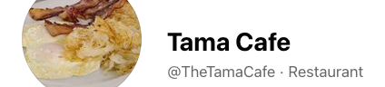

#

  # Breakfast Served All Day
  # Daily Lunch Specials

  

    <i data-feather="phone"></i>&nbsp;&nbsp;&nbsp;Call <b>(641) 481-7232</b> for carry-out orders.&nbsp;&nbsp;&nbsp;<i data-feather="phone"></i>
  

  
<!--
  

    
    

      <h5 class="card-title">Skillets</h5>
      
Build your own skillet, comes with 2 eggs, hash browns, and up to 3 ingredients, and your choice of toast.

      
$ 9.95

    

    <ul class="list-group list-group-flush">
      <li class="list-group-item">Cras justo odio</li>
      <li class="list-group-item">Dapibus ac facilisis in</li>
      <li class="list-group-item">Vestibulum at eros</li>
    </ul>
    

      <a href="#" class="card-link">Card link</a>
      <a href="#" class="card-link">Another link</a>
  

  

-->

{}
  Build your own skillet, comes with 2 eggs, hash browns, and up to 3 ingredients, and your choice of toast.  _$9.95_  

  Fresh made to order 3 egg omelet with up to 3 ingredients and your choice of toast. _$8.95_

  #### Ingredients:
  Cheese, green peppers and onions, mushrooms, tomatoes, spinach, bacon, sausage, and ham.

  #### Choice of Toast:
  White, wheat, rye, English muffins, and southern style biscuits.
{}

{}
  Eggs cooked any style, your choice of meat, side of hash browns, and your choice of toast.  
  1 egg combo _$7.95_  
  2 egg combo _$8.95_  
  3 egg combo _$9.95_  
{}

{}
  Served with your choice of meat.  
  Short stack (2) _$6.95_ &bullet; Full stack (3) _$7.95_  
{}

{}
  3 slices of mouthwatering French toast and your choice of meat. _$8.95_
{}

{}
  Half order _$5.95_  &bullet;  Full order _$6.95_
{}

{}
  Comes with 1 pancake, 2 eggs cooked your way, 2 sausages, 2 slices of bacon, and your choice of toast. _$11.95_
{}

{}
  Turn any skillet into a handful of goodness. _$10.95_
{}

{}
  Single pancake _$3.00_  
  2 slices of bacon _$2.25_  
  2 sausage links _$2.25_  
  Large slice of ham _$2.25_  
  1 egg cooked anyway _$1.65_  
  Toast _$1.95_  
  Hash browns _$3.95_  
{}

{}
  Comes with lettuce, tomato, and pickles, and a side of fries.  
  Hamburger _$8.95_  
  Cheeseburger _$8.95_  
  Mushroom and swiss _$8.95_  
  Patty melt _$8.95_  
  Tenderloin _$8.95_  
  Chicken sandwich (grilled or fried) _$9.95_  
  Fish sandwich _$9.95_  
  Grilled cheese _$6.95_  
{}

{}
  Chicken strips and fries _$9.95_  
  Fish strips and fries _$9.95_  
{}

{}
  Soup and salad _$4.95_  
  House salad _$3.95_  
  Chicken salad _$8.95_  
{}

{}
  Grilled cheese or chicken strips, comes with fries. _$5.00_
{}

{}
  _$1.50_
{}

